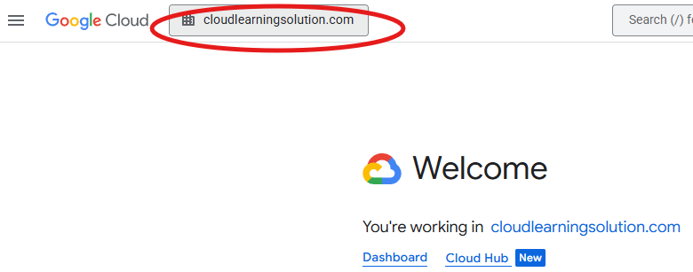

# Week 2: Core Architecture - Hands-On Workshop

---

## Module Learning Objectives

By the end of this workshop, participants will be able to:

- Compare and contrast AWS and Google Cloud global infrastructure architectures
- Explore topologies across both platforms
- Map AWS services to Google Cloud service equivalents for AI/ML pipeline workloads

---

## Prerequisites

- Completion of Module 1: Cost Optimization
- AWS Management Console access with infrastructure permissions
- Google Cloud Console access with project access rights

---

## Workshop Overview

This hands-on workshop builds upon the cost management foundation from Module 1 to establish the technical architecture knowledge required for successful AWS to Google Cloud ML migrations. Using **console interfaces** and **CloudShell**, participants will gain practical experience with infrastructure services, networking, and IAM configurations across both platforms.

---

## Module 1: AWS Global Infrastructure and Core Resources

# 🧪 Lab 2.1: AWS Regions and Availability Zones Architecture Deep Dive

**Duration:** 45 minutes
**Objective:** Explore AWS global infrastructure and availability zone design using CLI and console-based inspection—without finalizing resource creation.

---

## 1. Prerequisites

1. Access to AWS Management Console with EC2 and CloudShell permissions
1. AWS CLI available via CloudShell or local environment
1. Familiarity with basic AWS terminology: Region, Availability Zone, CLI
1. No EC2 instance creation required

---

## 2. Theory Overview

2. AWS infrastructure is organized into regions and availability zones.
2. Each region is a geographically isolated location with multiple AZs.
2. Availability Zones are independent failure domains within a region.
2. Opt-in regions must be manually enabled before use.
2. High availability strategies use multiple AZs to ensure fault tolerance.

---

## 3. Hands-On Exploration Steps (Do Not Finalize Resources)

3. Access AWS Console
3. Navigate to [AWS Console](https://console.aws.amazon.com)
3. Launch CloudShell from the top navigation bar

3. Explore Available Regions
3. Run: `aws ec2 describe-regions --output table`
3. Run: `aws ec2 describe-regions --query 'Regions[*].[RegionName,OptInStatus]' --output table`
3. Identify which regions require opt-in

3. Explore Availability Zones
3. Run: `aws ec2 describe-availability-zones --output table`
3. Run: `aws ec2 describe-availability-zones --region us-east-1 --output table`
3. Observe zone names and states

3. Inspect Region Selector in EC2 Console
3. Navigate to EC2 > Instances > Launch Instance
3. Use the region dropdown to compare AZ counts
3. Cancel before launching any instance

3. Sketch Region-to-Zone Mapping
3. Identify 3 regions and list their AZs
3. Note differences in zone naming and availability

---

## 4. Deliverables

4.1 Table of AWS Regions and Opt-In status
4.2 List of AZs for `us-east-1` and two other regions
4.3 Notes on regional design considerations and zone distribution

---

## 5. Supplemental Materials

5.1 Runbook: `runbooks/aws-region-az-exploration.md`
5.2 Playbook: `playbooks/aws-ha-topology-strategy.md`

---

## 6. Notes and Warnings

6.1 Do not launch EC2 instances or other resources during this lab
6.2 AZ names (e.g., `us-east-1a`) are account-specific and may vary
6.3 Opt-in regions may require manual activation before use

---

## 7. Verification Source

7.1 Validated against [AWS EC2 Regions and AZs Documentation](https://docs.aws.amazon.com/AWSEC2/latest/UserGuide/using-regions-availability-zones.html)

---

# 🧪 Lab 2.2: AWS Edge Locations and CloudFront Global Network Exploration

**Duration:** 45 minutes
**Objective:** Explore AWS’s global content delivery infrastructure using CloudFront and edge location metadata—without deploying distributions or modifying resources.

---

## 1. Prerequisites

1.1 AWS Management Console access with CloudFront and CloudShell permissions
1.2 AWS CLI available via CloudShell or local environment
1.3 Basic understanding of CDN concepts (edge location, origin, cache)
1.4 No CloudFront distribution creation required

---

## 2. Theory Overview

2.1 AWS CloudFront is a content delivery network (CDN) that uses a global network of edge locations.
2.2 Edge locations cache content closer to users to reduce latency.
2.3 Regional edge caches act as mid-tier caches between origin and edge locations.
2.4 CloudFront integrates with other AWS services like S3, EC2, and Lambda@Edge.
2.5 Edge locations are distributed across major cities and regions worldwide.

---

## 3. Hands-On Exploration Steps (Do Not Finalize Resources)

3.1 Access AWS Console
  3.1.1 Navigate to [AWS Console](https://console.aws.amazon.com)
  3.1.2 Launch CloudShell from the top navigation bar

3.2 Explore Edge Location Metadata
  3.2.1 Run: `aws cloudfront list-distributions --output json`
  3.2.2 If no distributions exist, proceed to inspect global infrastructure
  3.2.3 Run: `aws cloudfront get-distribution-config --id <distribution-id>` (only if read-only distributions exist)

3.3 Review Global Edge Network
  3.3.1 Navigate to **CloudFront > Locations** in AWS Console
  3.3.2 Observe map of edge locations and regional edge caches
  3.3.3 Note geographic distribution and latency zones

3.4 Inspect CloudFront Console
  3.4.1 Navigate to **CloudFront > Distributions**
  3.4.2 Select any existing distribution (if available)
  3.4.3 Review origin settings, cache behaviors, and edge associations
  3.4.4 Do not create or modify any distributions

3.5 Compare Edge Location Coverage
  3.5.1 Identify 3 cities with edge locations from the AWS map
  3.5.2 Note proximity to major user populations
  3.5.3 Record latency benefits and strategic placement rationale

---

## 4. Deliverables

4.1 List of global edge locations and regional edge caches
4.2 Summary of CloudFront distribution architecture (if read-only access available)
4.3 Notes on geographic distribution and latency optimization strategy

---

## 5. Supplemental Materials

5.1 Runbook: `runbooks/aws-cloudfront-edge-location-inspection.md`
5.2 Playbook: `playbooks/aws-global-cdn-strategy.md`

---

## 6. Notes and Warnings

6.1 Do not create or modify CloudFront distributions during this lab
6.2 Edge location availability may vary by region and account
6.3 CLI output may be empty if no distributions exist—this is expected

---

## 7. Verification Source

7.1 Validated against [AWS CloudFront Documentation](https://docs.aws.amazon.com/AmazonCloudFront/latest/DeveloperGuide/Introduction.html)

---

# Lab 2.3: Google Cloud Regions and Zones Architecture Analysis

---

# 🧪 Lab 2.3: Google Cloud Regions and Zones Architecture Analysis

**Duration:** 45 minutes
**Objective:** Explore Google Cloud’s global infrastructure, focusing on regions, zones, and service availability—without deploying any resources.

---

## 1. Prerequisites

1.1 Google Cloud Console access with project-level permissions
1.2 Cloud Shell enabled
1.3 Basic understanding of cloud infrastructure concepts
1.4 Ensure the Compute Engine API is enabled for your project
1.5 No VM instance creation required

---

## 2. Theory Overview

2.1 Google Cloud has over 40 regions and 100+ zones globally.
2.2 Each region is a geographic location containing multiple isolated zones.
2.3 Zones are independent failure domains connected via Google’s private high-speed network.
2.4 Most regions contain three or more zones housed in separate physical facilities.
2.5 Service availability may vary by region and zone.

---

## 3. Hands-On Exploration Steps (Do Not Finalize Resources)

3.1 Access Google Cloud Console
  3.1.1 Navigate to [Google Cloud Console](https://console.cloud.google.com)
  3.1.2 Use the Project Picker to select your project
  3.1.3 

3. After selecting the project picker regardless of the default setting, ergo; **cloudlearningsolution**. In the **Select a resource** box, select if not already displayed the organization **cloudlearningsolution**, then select your project by clicking **All** and then selecting your project name. Review the Type column to ensure you are selecting a project and not an organization or folder.
    **Note**: You may need to expand the domain name to see and select your project.


4. Open Cloud Shell by clicking the terminal icon located by the top right area in the Google Cloud Console, hover over the icons until you find and select the **Activate Cloud Shell** button.

5. Cloud shell will open in a new pane at the bottom of the console. If prompted select **Continue**, and Cloud shell will require authentication. Another prompt will appear, Click **Authorize** to allow Cloud Shell to access your Google Cloud resources. If prompted to sign in again, sign in with your Google account to complete the authentication process.

**Note**: IAM controls access to resources in Cloud Shell. Your presenter will need to grant you access and may allow specific actions to be denied as a learning exercise.

3.2 Activate Cloud Shell
  3.2.1 Click the terminal icon in the top navigation bar

3.3 Explore Regions and Zones via CLI
  3.3.1 Run: `gcloud compute regions list --format="table(name,status,zones.len():label=ZONES)"`
  3.3.2 Run: `gcloud compute regions describe us-central1`
  3.3.3 Run: `gcloud compute zones list --format="table(name,region,status)"`
  3.3.4 Run: `gcloud compute zones list --filter="region:us-central1" --format="table(name,status)"`

3.4 Inspect Region-Zone Mapping via Console
  3.4.1 Navigate to **Compute Engine > VM instances > Create Instance**
  3.4.2 Use the Region dropdown to view available zones
  3.4.3 Cancel before deploying any instance

3.5 Check Service Availability
  3.5.1 Run: `gcloud ai models list --region=us-central1 2>/dev/null || echo "Vertex AI not available in this region"`
  3.5.2 Run: `gcloud compute machine-types list --zones=us-central1-a --filter="name:n1-standard"`

---

## 4. Deliverables

4.1 Region and zone availability matrix
4.2 Notes on service availability for Vertex AI and machine types
4.3 Observations on zone distribution and naming conventions

---

## 5. Supplemental Materials

5.1 Runbook: `runbooks/gcp-region-zone-exploration.md`
5.2 Playbook: `playbooks/gcp-multi-zone-deployment-strategy.md`

---

## 6. Notes and Warnings

6.1 Do not finalize VM creation during this lab
6.2 Zone names (e.g., `us-central1-a`) may vary by region and project
6.3 Some services are region-specific—verify availability before planning deployments

---

## 7. Verification Source

7.1 Validated against [Google Cloud Regions and Zones Documentation](https://cloud.google.com/compute/docs/regions-zones)

---

# Lab 2.4: Google Cloud Edge Network and Cloud CDN Exploration

---

## Duration

**30 minutes**

## Objective

Implement global content delivery using Google's edge network.

---

## Prerequisites

- Google Cloud Console access with project access rights
- Cloud Shell access enabled
- Basic understanding of CDN concepts

---

## Theory Review

- Google Cloud operates **202+ network edge locations** across 200+ countries and territories
- **Cloud CDN:** 100+ cache locations for content delivery
- **Media CDN:** 3,000+ locations for video streaming and large file downloads
- Global load balancing with **Anycast IP addresses**
- Integration with Google’s private global network backbone


## 🧪 Hands-On Lab

### Part 1: Cloud Storage Setup for CDN Origin (10 minutes)

#### ✅ Step 1: Create Cloud Storage Bucket via Console

**Navigate to Cloud Storage:**

1. Go to **Cloud Storage > Buckets**
2. Click **Create bucket**

**Configure Storage Bucket:**

- Name: `ml-cdn-content-[random-number]`
- Location type: Multi-region
- Default storage class: Standard
- Access control: Fine-grained
- Click **Create**

**Upload Sample Content:**

1. Click your bucket name
2. Click **Upload files**
3. Upload an image, video, or HTML file
4. Click **Upload**

**Make Content Publicly Accessible:**

1. Select the uploaded file
2. Click **Permissions** tab
3. Click **Grant access**
4. New principals: `allUsers`
5. Role: `Storage Object Viewer`
6. Click **Save**


### Part 2: Cloud CDN Configuration (15 minutes)

#### 🌐 Step 2: Create HTTP Load Balancer with CDN via Console

**Navigate to Load Balancing:**

1. Go to **Network Services > Load balancing**
2. Click **Create load balancer**

**Choose Load Balancer Type:**

- Select **Global external Application Load Balancer**
- Click **Configure**

**Configure Backend (Enable Cloud CDN):**

- Name: `ml-cdn-backend`
- Backend type: Cloud Storage bucket
- Cloud Storage bucket: Select your bucket
- Enable **Cloud CDN**
- Cache mode: `CACHE_ALL_STATIC`
- Default TTL: `3600 seconds`

**Configure Frontend:**

- Name: `ml-cdn-frontend`
- Protocol: HTTP
- Port: 80
- IP Address: Create IP address (`ml-cdn-ip`)

**Review and Create:**

- Name: `ml-cdn-lb`
- Click **Create**


#### 🔍 Step 3: Verify CDN Configuration via Cloud Shell

**List Load Balancers:**

```python
gcloud compute url-maps list --format="table(name,defaultService)"

gcloud compute url-maps describe ml-cdn-lb --global

gcloud compute backend-services list --global --format="table(name,enableCDN,cdnPolicy.cacheMode)"

Part 3: CDN Performance Testing (5 minutes)
```

📊 Step 4: Test CDN Performance via Cloud Shell

Get Load Balancer IP:

```python

LB_IP=$(gcloud compute addresses describe ml-cdn-ip --global --format="value(address)")
echo "Load Balancer IP: $LB_IP"
```

Test CDN Cache Behavior:

# First request (cache miss)
```python
echo "First request (cache miss):"
curl -I http://$LB_IP/your-file.jpg | grep -E "(HTTP|Cache-Control|Age|X-Cache)"
```

# Second request (cache hit)
```python
echo "Second request (cache hit):"
curl -I http://$LB_IP/your-file.jpg | grep -E "(HTTP|Cache-Control|Age|X-Cache)"
```

Test Global Distribution:

```python
curl -o /dev/null -s -w "Total time: %{time_total}s\n" http://$LB_IP/your-file.jpg
```

🌍 Step 5: Configure Custom Domain and SSL via Console
1. **Reserve Global IP Address:**
   - Go to **VPC Network > IP addresses**
   - Click **Reserve external static address**
   - Name: `ml-cdn-ssl-ip`
   - Type: Global
   - Click **Reserve**

2. **Create SSL Certificate (Recommended: Google-managed):**
   - Go to **Network Security > SSL certificates**
   - Click **Create SSL certificate**
   - Name: `ml-cdn-ssl-cert`
   - Mode: Google-managed
   - Domains: Enter your domain name
   - Click **Create**
3. **Update Load Balancer for HTTPS:**
   - Go to **Network Services > Load balancing**
   - Click on `ml-cdn-lb`
   - Click **Edit**
   - Add new frontend:
     - Name: `ml-cdn-https-frontend`
     - Protocol: HTTPS
     - Port: 443
     - IP address: `ml-cdn-ssl-ip`
     - Certificate: `ml-cdn-ssl-cert`
   - Click **Update**
---
